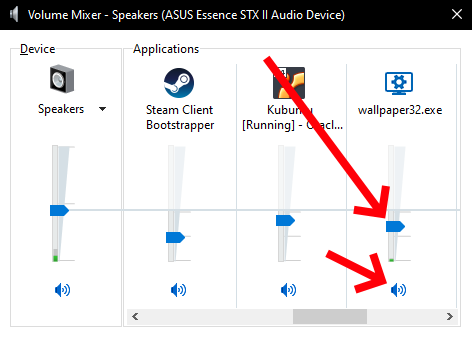

# No Sound Playing / Audio Output Problems
This help guide will help you figure out any issue related to audio playback with wallpapers. First of all, you should make sure that you are using a wallpaper that actually contains audio by trying a few others. Many wallpapers are completely silent. If you are sure your wallpaper contains audio, proceed with this guide.

::: warning Please note
If your sound keeps turning off and back on within a matter of seconds, please read the following help guide instead:

* [Sound / audio turns on and off intermittently](/audio/intermittent)
:::

## Ensure Wallpaper Engine is not muting itself
There are three places in the app which allow you to mute audio output:

1. In the **General** tab of the Wallpaper Engine settings, there is an option called **Audio Output**. Make sure this is enabled.
2. Click on the **Displays** button in the upper right corner of the main Wallpaper Engine window. This will show you an overview with all your screens. Each screen has a mute button in the lower left corner. Make sure your screens are not muted.
3. When selecting a wallpaper, you will find a **Volume** option on the right-hand side, make sure it is not set to zero or a low volume. If the option says **Audio disabled in display settings**, your display is muted, check step 2 again and unmute your screen.

## Check the Windows audio mixer
Wallpaper Engine lets all audio output be handled by Windows, so if Wallpaper Engine itself is not muted, the issue must be somewhere in your Windows setup. First, check the Windows audio mixer and ensure that Wallpaper Engine is not muted or set to a very low volume, as shown in the following screenshot:

## Check the selected audio device
Another possible reason for the lack of audio output could be that Windows has selected the wrong audio output device for Wallpaper Engine, try manually forcing your desired audio output device to be used:

1. Right-click on the audio icon next to the clock in the Windows tray and select **Open Sound settings**.
2. Scroll down to the bottom of the page that opens and click on **App volume and device preferences**.
3. A list of all applications playing audio will be shown. Find Wallpaper Engine and in the **Output** column, select the correct audio output device. If you are unsure, try all possible options. A restart of Wallpaper Engine may be necessary for this to take effect.

If you use multiple audio devices (especially when using USB or Bluetooth audio devices) and notice that audio cuts out when a device disconnects or reconnects, Windows sometimes does not reliably switch audio devices on-the-fly for running programs. This cannot be fixed from our end, in these rare cases you may need to restart Wallpaper Engine so that Windows starts to correctly handle the audio output again. You can also try and reinstall and update any audio drivers and see if that alleviates these types of issues.

## Reset all audio codecs

If audio output is still not playing at this point, some audio codecs may be broken, this is mainly relevant when using **Video** type wallpapers. You can double-check this by right-clicking on your wallpaper in Wallpaper Engine and selecting **Open in Explorer**. You should see the source video file (usually an **.mp4** file), open that file with Windows Media Player and check if it plays audio. **Please note:** It is very important that you test this with Windows Media Player only - other video players are irrelevant for this test as the underlying audio codecs are used by Wallpaper Engine as well. If no audio is playing in Windows Media Player, then either the video file does not have audio or the audio codecs on your system are indeed broken or missing.

In that case, you can use the *Codec Tweak Tool* as explained on the following page to reset all audio and video codecs on your system, afterwards restart Wallpaper Engine and try again:

* [Videos Black / Not Playing Properly - Codec Tweak Tool](noshow/notplaying.html#codec-tweak-tool)

