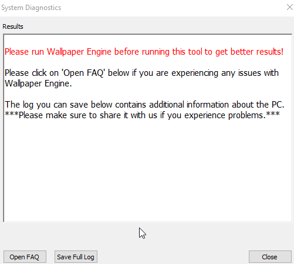

# Use the Wallpaper Engine scan tool to create a debug log

* Make sure Wallpaper Engine is running (if possible).
* Choose the 4th launch option in Steam (Scan for conflicting applications):
  

* Click on Save Full Log and save it on your desktop:
  

* Share the log file with our developers:

  * Go to [pastebin.com](https://pastebin.com/) and copy-paste the contents of the log file in there, afterwards share the link.
  * Alternatively, send it the log file to us directly via email, either by responding to an existing email discussion or by including a link to an on-going discussion on our other support channels

::: tip
Even if the scan tool does not report any issues at first glance, a deeper investigation of the log file often reveals common computer issues which help us to quickly provide advice to you how to fix your technical issues.
:::