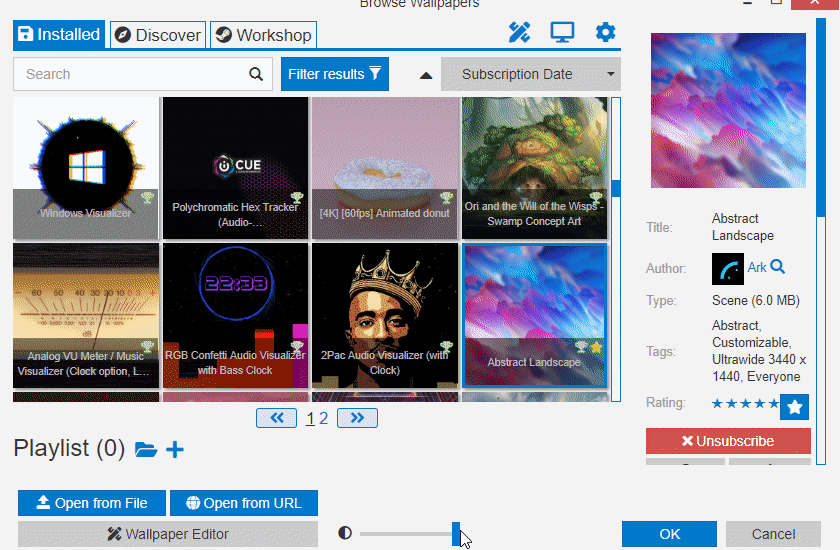

# Wallpaper Engine window is transparent

If your Wallpaper Engine user interface is see-through, you have likely accidentally used the slider at the bottom of the window to reduce its opacity. Simply drag it to the right to revert the opacity again:

::: tip
You can use the slider to peek at wallpapers while configuring or browsing them without having to move the Wallpaper Engine window.
:::