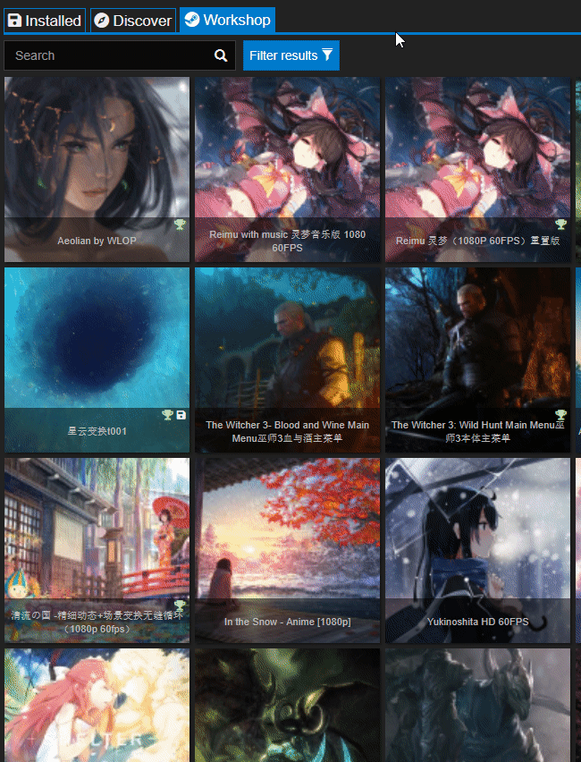

# Excluir ciertos fondos de la búsqueda

Usa siempre la pestaña Workshop para buscar fondos nuevos. Steam Workshop no cuenta con la misma capacidad de filtrado que el programa, por lo que le mostrará más contenido que no te interesa.

## Excluir géneros concretos (por ejemplo, anime)

Puedes eliminar categorías que no te gusten. Abre la pestaña «Workshop» en Wallpaper Engine y haz clic en el botón «Filtrar resultados» en la esquina superior izquierda para habilitar la barra lateral de filtros. Deselecciona todas las categorías que no quieras ver en los resultados.

Si no quieres ver fondos de anime, quita las categorías *Anime* y *MMD (Miku-Miku-Dance)*. Además, también puedes quitar las categorías *Dibujos animados* y *Chicas*, ya que también pueden contener anime, pero te perderás otro tipo de contenido.

## Excluir clasificaciones por edades

Steam Workshop admite contenido adulto hasta cierto grado como, por ejemplo, desnudez. Si no quiere ver este tipo de contenido, seleccione solo «Para todas las edades» en los filtros de clasificación por edades:

La mayoría del contenido está bien clasificado y así se excluirá la gran mayoría de contenido adulto. Si llega a encontrarse con ese tipo de contenido porque se ha clasificado «Para todas las edades», use la función de Informar del programa. Tras inspeccionarlo, el contenido se clasificará correctamente o se eliminará.

## Informar de contenido que rompe las reglas

Tanto nosotros como los administradores y moderadores de Steam borramos fondos de pantalla que rompen las reglas día tras día. Infórmenos de los fondos que rompen las normas y ayúdenos a encontrarlos.

Workshop permite a los usuarios publicar obras sin que las comprobemos antes de que sean visibles: así es como funciona Steam Workshop y no podemos cambiarlo. Solo podemos eliminar las obras después de que las suban. Si le supone un problema, asegúrese de seleccionar la etiqueta *Aprobado* en la configuración del filtro, ya que esos fondos se eligen y se comprueban a mano. Lea las secciones superiores para aprender a configurar los filtros y así eliminar cierto tipo de contenido que prefiere no ver.