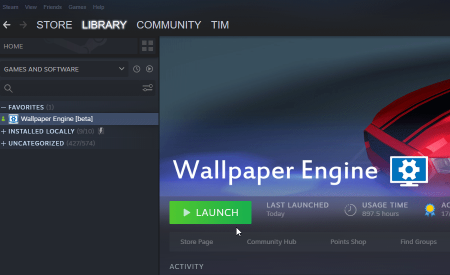

# Wallpaper Engine スキャンツールを使ってデバッグログを作成する

Wallpaper Engineで技術的な問題が発生し、FAQを見ても解決できない場合、システムログファイルを作成し、お問い合わせの際に添付していただくことができます。

1. Wallpaper Engineを起動させます（可能な場合）。
2. Steamで4番目の起動オプションを選択します（*競合するアプリケーションのスキャン*。 下の短い動画をご覧ください）。
3. **完全なログを保存**をクリックし、デスクトップに保存します（下の短い動画をご覧ください）。
4. 次のメソッドデベロッパーのいずれかを使用してログファイルをシェアします。
    * [pastebin.com](https://pastebin.com/)に行き、ログファイルの中身をコピーペーストして、その後、ペーストしたリンクをシェアします。
    * または、メールにログファイルを添付して送っていただくこともできます。 既にメールでディスカッションを開始されている場合は、ログファイルを添付して前のメールに返信してください。 初めてメールを送られる場合は、問題に関する情報か、既存のディスカッションのリンクをお書きください。
5. *オプション：*クラッシュが起きた場合は、*wallpaper_engine*ディレクトリの中で**.mdmp**ファイルを探し、それもメールでお送りいただくか、 どこかにアップロードしてリンクをお送りください。 .mdmpファイルがたくさんある場合は、最新のものをお送りください。 ::: tip 最初の1回でスキャンツールが問題を報告しない場合でも、ログファイルを詳しく調べると、よくあるコンピュータの問題が発見され、技術的問題の解決に向けたアドバイスを差し上げられることがよくあります。 :::

#### 追加の動画ヘルプ

**ステップ2**

**ステップ3**

