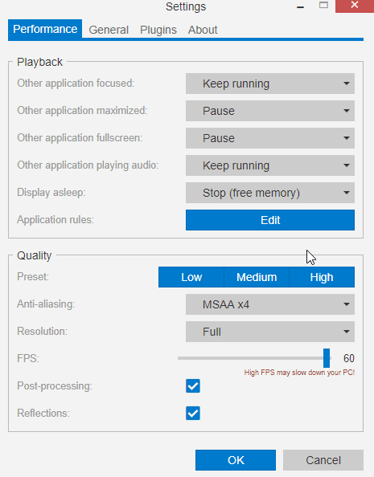

---
tags:
  - application
  - rules
  - exception
  - whitelist
  - blacklist
  - lags
  - laggy
  - game
  - performance
  - fps
  - crash
  - sound
  - audio
  - intermittent
---

# 特定のアプリまたはゲームで起きる問題の修正

特定のアプリケーションまたはゲームで問題が起きる場合、Wallpaper Engineを設定し、例えば、問題が起きているアプリケーションが起動したりオーディオをプレイしたりしていることを検知したときに、ある動作を行うようにすることができます。

## アプリケーションルールの設定

Wallpaper Engine設定の*パフォーマンス*タブで、*アプリケーションルール*ラベルの隣にある*編集*ボタンをクリックすると、これまでに設定されているカスタムルールがすべて表示されます。 *新規ルール作成*をクリックすると、Wallpaper Engineの特定のアプリケーションに対する特別な動作を設定することができます。

システム上で起動している.exeファイルすべてがリストアップされます。 問題のある.exeをリストから選択するか、その正確な名前を入力します。 他の2つのオプションで、条件と動作を設定することができます。 詳細と具体例については下記をご覧ください。

::: tip Wallpaper Engineは正確な.exe名だけを識別します。場所はどこにあってもかまいません。*アプリケーション名*フィールドに.exe名だけを入力してください。 大文字小文字を含め、.exe名が正確にマッチしていることを確認してください。 :::

### アプリまたはゲームで起きるパフォーマンスの問題の修正

特別なルールを設定したいプログラムの.exeをリストから選択するか、**アプリケーション名**に入力します。 その後、**条件**を**実行中**に、**壁紙再生**を**停止（メモリ解放）**に設定します。 これにより、Wallpaper Engineはそのアプリケーションまたはゲームが起動したときにすべての壁紙をメモリから削除します。これですべての互換性の問題は解決します。

### バックグラウンドで録音しているツールの断続的なサウンドの修正

特別なルールを設定したいプログラムの.exeをリストから選択するか、**アプリケーション名**に入力します。 その後、**条件**を**オーディオ再生されている**に、**壁紙再生**を**再生を続ける**に設定します。 これにより、Wallpaper Engineは、問題のアプリケーションがオーディオを再生したり録音したりしてもミュートしません。 Windowsはオーディオの再生と録音を区別しません。録音が行われているときにWallpaper Engineが断続的にミュートとミュート解除を繰り返すのはそのためです。 多くのゲームストリーミングアプリケーションは偶発的に、あなたが知らないうちにこれを行うことがあります。

### その他の動作

選択可能な条件や壁紙再生オプションをチェックして、いろいろなアプリケーションルールを設定することができます。 また、特定のアプリケーションを起動したときにWallpaper Engineをミュートしたり停止したりする設定も可能です。

::: tip また、Wallpaper Engine設定の**パフォーマンス**タブで、すべてのアプリケーションに対する設定を変更することもできます。 例えば複数のゲームでパフォーマンスの問題が起きる場合、単に**他のアプリケーションがフルスクリーンになった場合**オプションを**停止（メモリ解放）**にしてしまうということも考えられます。そうすれば、Wallpaper Engineはゲームやフルスクリーンのアプリケーションが起動したときにオフになります。 :::
