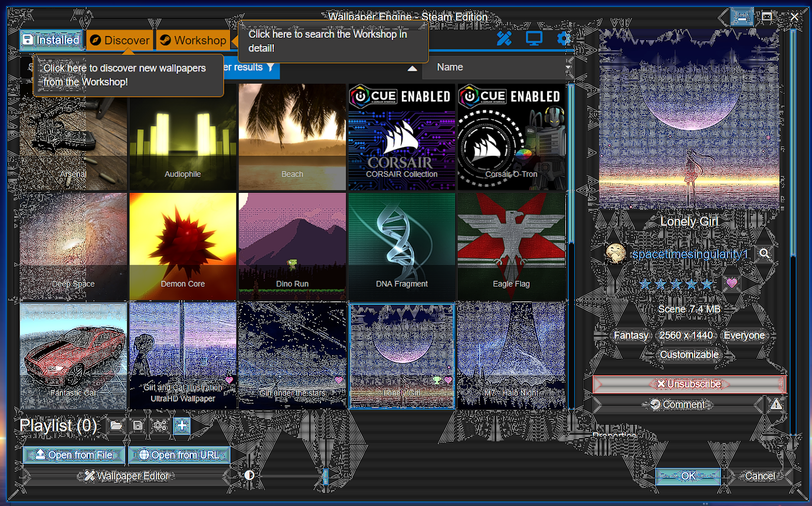

---
tags:
  - user interface
  - green
  - white
  - pixelated
  - unreadable
---

# Wallpaper Engineのウィンドウが正しく表示されない

Wallpaper Engineブラウズウィンドウが正しく動作しない場合、通常は、グラフィックスカードドライバに問題があるか、アンチウイルスアプリケーションが干渉していることが原因です。 詳しくは下の説明をお読みください。

::: warning
注意 このセクションは、Wallpaper Engineの**インターフェース**が黒くなっていたり壊れていたりする場合の説明です。 **壁紙が黒い**場合はこちらをご覧ください：[画面が黒い / ビデオが再生されない](/noshow/notplaying.html)。
:::

## Wallpaper Engineブラウザが黒または白になっている

ほとんどの場合、これはWallpaper Engineのユーザーインターフェースが誤ってアンチウイルスアプリケーションにブロックされていることによって起こります。 アンチウイルスアプリケーションがWallpaper Engineを無視するように例外設定を行ってください。特にwallpaper_engineインストールディレクトリの実行可能ファイルすべて、中でも**wallpaper_engine/bin/ui32.exe**は例外にしてください。

アンチウイルスアプリケーションがWallpaper Engineの重要なファイルを永久的にロックしている場合もあります。このときは、あとでWallpaper Engineファイルを検証したり、Wallpaper Engineを再インストールしたりする必要があります。

* [Steam サポート：アプリケーションファイルの整合性確認](https://support.steampowered.com/kb_article.php?ref=2037-QEUH-3335)

アンチウイルスアプリケーションの設定後、Steamによる確認で問題が解決しない場合は、SteamからWallpaper Engineを再インストールしてみてください。 アンチウイルスが暴走した場合は、Wallpaper Engineが使用するファイルパスを永久的にブロックしてしまっていることがあります。 その場合はまずアンチウイルスをアンインストールしてから、Wallpaper Engineを別のディレクトリにインストールしてください。ディレクトリはSteamで新しいSteamゲームライブラリを作ると変更できます。

If the problem persists, turn off Wallpaper Engine. Then re-launch Wallpaper Engine using the third launch option in Steam labeled "disable UI hardware acceleration".

## Wallpaper Engineのインターフェースに緑のノイズや白いラインが入る

Your graphics card drivers are broken or misconfigured. Download the latest drivers for your graphics cards (even if you already have the latest drivers) and perform a clean re-installation of the drivers. Is is important that you first uninstall your current drivers and then install the latest drivers to ensure any broken files or settings are removed.

If the problem persists, turn off Wallpaper Engine. Then re-launch Wallpaper Engine using the third launch option in Steam labeled "disable UI hardware acceleration".

**If the Wallpaper Engine user interface has white lines**: You have **Nvidia Image Sharpening** turned on for all applications. Turn it off in your Nvidia drivers or do a clean reinstallation of your Nvidia drivers by uninstalling your current ones first.

 *White lines will be visible all over the application window if Nvidia image sharpening is turned on for Wallpaper Engine by mistake.*

### 珍しいSteamオーバーレイバグによってWallpaper Engineユーザーインターフェースが破損している

The other possible reason for a black application window is a rare Steam bug with the Steam overlay. You can try the following:

Turn off Wallpaper Engine completely (right-click on the tray icon and then select "Quit"). Afterwards, open up Steam, right-click on Wallpaper Engine, select "Properties" and then disable the "Enable Steam Overlay while in-game" option. After disabling the option, try to restart Wallpaper Engine via Steam. 