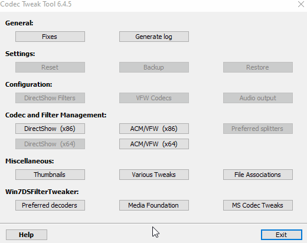

- - -
태그:
  - 활성영화 창
  - 활성 영화
  - 검은색
- - -

# 비디오 검은 색 / 제대로 재생되지 않습니다

검은 화면 및 *비디오* 유형의 배경화면 관련 기타 문제는 *항상* 잘못된 그래픽 카드 드라이버나 비디오 코덱이 원인입니다. 다음 단계를 정확한 순서대로 따라하세요. 이 가이드를 처음부터 끝까지 따라하면 문제가 해결됩니다:

:: 경고 이 항목은 검은색이 되거나 제대로 재생되지 않는 Wallpaper Engine **배경화면**에 대한 내용입니다. **Wallpaper Engine 인터페이스가 검은색**이면, 여기를 확인하세요: [Wallpaper Engine 사용자 인터페이스가 검은색입니다](/interface/broken.html#wallpaper-engine-interface-is-black). :::

## 그래픽 카드 드라이버 완전히 새로 설치

대부분의 경우 그래픽 카드 드라이버를 새로 설치하면 비디오 배경화면 관련 문제 유형은 거의 다 해결할 수 있습니다. 여기에는 검은색 화면과 별도의 창에 배경화면이 표시되는 경우(**"활성영화 창"**)도 포함됩니다.

1. 그래픽 카드의 최신 그래픽 카드 드라이버를 다운로드하세요 (또는 Nvidia와 Intel처럼 두 개가 있다면 모두 다운로드):

* [Nvidia GeForc](https://www.nvidia.com/Download/index.aspx)
* [AMD Radeon](https://www.amd.com/support)
* [Intel Graphics](https://downloadcenter.intel.com/product/80939/Graphics-Drivers)

2. 기존 그래픽 카드 드라이버를 완전히 삭제하고, 물어보는 경우 모든 기존 설정을 제거하세요. Nvidia 드라이버에는 "새로 설치 실행" 체크박스도 있습니다.

이 방법을 잘 모르겠으면, [디스플레이 드라이버 제거 프로그램("DDU")](https://www.guru3d.com/files-details/display-driver-uninstaller-download.html)를 사용할 수도 있습니다.

3. 1번에서 다운로드한 드라이버를 설치하세요.
4. PC를 다시 시작하고 제대로 작동하는지 확인하세요.

::: 팁 완전히 새로 설치하는 것이 매우 중요합니다. 새 드라이버를 설치하기 전 기존 그래픽 카드 드라이버와 드라이버 설정을 완전히 삭제하지 않으면, 작동하지 않습니다. :::

## Codec Tweak 도구

그래픽 카드 드라이버를 완전히 새로 설치한 후에도 작동하지 않으면, 비디오 코덱을 초기화해 보세요:

* Codec Tweak 도구 다운로드: [여기를 클릭하세요](https://www.codecguide.com/download_other.htm)
* "미디어 파운데이션" 메뉴의 체크박스가 모두 선택되지 **않았는지** 확인한 다음, 설정을 적용하세요:

* PC를 다시 시작한 뒤 영향을 받은 배경화면을 시도해 보세요.

## 추가 비디오 코덱

이전 단계를 진행해도 영향을 받은 비디오 배경화면이 여전히 작동하지 않으면, 이 가이드의 설명에 따라 LAV를 다운로드하고 DirectShow를 사용하세요:

* [LAV 및 DirectShow 사용](/videos/lav.html)