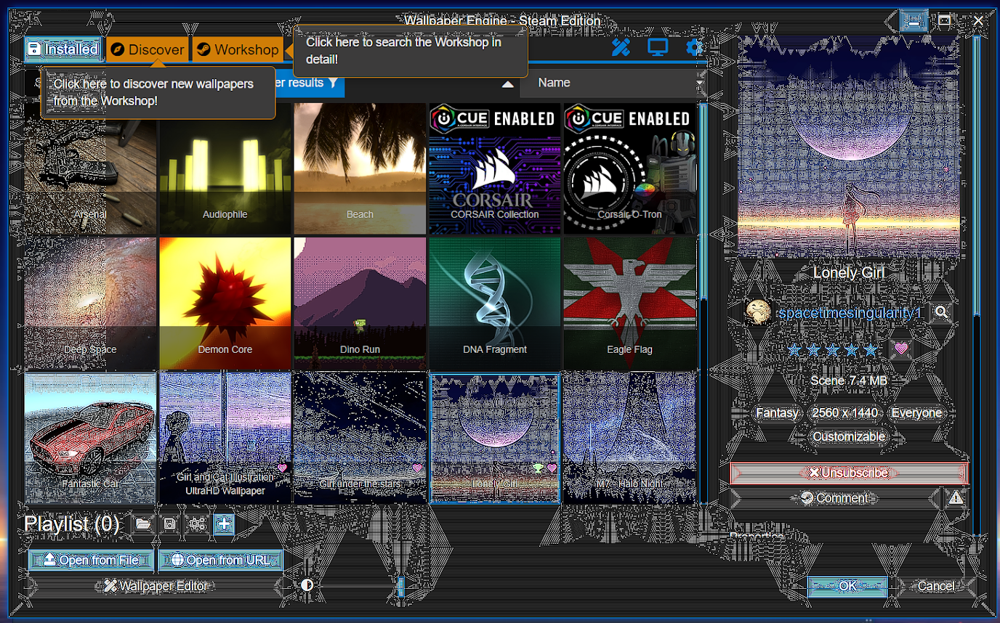

---
tags:
  - user interface
  - green
  - white
  - pixelated
  - unreadable
---

# Некорректное отображение окна Wallpaper Engine

Обозреватель Wallpaper Engine обычно не работает из-за неисправных драйверов видеокарты или проблем с программой-антивирусом. Вы найдете подробную информацию по этой проблеме ниже.

::: warning
Обратите внимание В данной статье рассматривается проблема Wallpaper Engine, которая делает **интерфейс** неисправным или при которой он отображается черным. Если **черными отображаются обои**, вам нужна статья [Черный экран / Видео не воспроизводится](/noshow/notplaying.html).
:::

## Обозреватель Wallpaper Engine черный или белый

В большинстве случаев, данная проблема вызвана ошибочной блокировкой пользовательского интерфейса Wallpaper Engine программой-антивирусом. Пожалуйста, занесите программу Wallpaper Engine в список исключений вашего антивируса. В первую очередь это касается ее загрузочных файлов и в особенности файла **wallpaper_engine/bin/ui32.exe**.

Иногда после этого необходимо провести проверку целостности файлов Wallpaper Engine или даже переустановить программу, если антивирус заблокировал некоторые важные файлы без возможности восстановления:

* [Steam Support: проверка целостности файлов игры](https://support.steampowered.com/kb_article.php?ref=2037-QEUH-3335)

Если после того, как вы настроили список исключений антивируса, проверка файлов с помощью Steam не решила ошибку, попробуйте переустановить Wallpaper Engine через Steam. Если ваш антивирус слишком хищный, он может даже заблокировать без возможности восстановления пути к файлам, которые использует Wallpaper Engine. В этом случае необходимо сначала удалить антивирус, а затем установить Wallpaper Engine в другой каталог. По желанию для этого можно создать новую библиотеку игр в Steam.

## Интерфейс Wallpaper Engine отображается с зелеными артефактами или белыми линиями

У вас неисправны или неправильно настроены драйвера видеокарты. Загрузите последнюю версию драйверов для вашей видеокарты (даже если у вас уже установлена последняя версия) и проведите чистую переустановку. Чтобы точно очистить систему от неисправных файлов и старых настроек, важно сначала удалить драйверы, а потом установить последнюю версию.

Если проблема не была решена, отключите Wallpaper Engine. Затем перезапустите Wallpaper Engine, использовав для этого третий вариант запуска программы в Steam (Disable UI hardware acceleration).

**Интерфейс Wallpaper Engine отображается с белыми линиями**: у вас включена функция **Nvidia Image Sharpening** (повышение резкости) для всех программ. Выключите эту функцию на драйверах Nvidia или проведите чистую переустановку драйверов Nvidia, полностью удалив старую версию с системы.

 *Wallpaper Engine отображается с белыми линиями по всему интерфейсу, если по ошибке для программы была включена функция повышения резкости Nvidia.*

### Пользовательский интерфейс Wallpaper Engine поврежден в результате редкой ошибки в работе оверлея Steam

Еще одна возможная причина, по которой у вас открывается черное окно программы — редко встречающаяся ошибка, связанная с работой оверлея Steam. Попробуйте следующее:

Полностью выключите Wallpaper Engine (нажмите правой кнопкой мыши на значок программы в панели задач и выберите «Выход»). Затем откройте Steam, нажмите правой кнопкой мыши на Wallpaper Engine, выберите «Свойства…» и затем снимите флажок «Включить оверлей Steam в игре». После отключения оверлея попробуйте перезапустить Wallpaper Engine через Steam. 