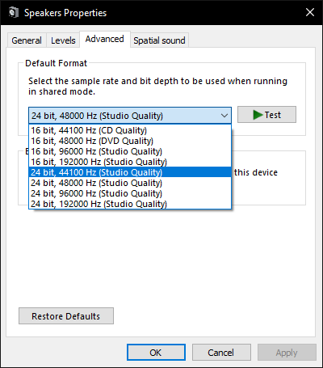

# Visualizer เสียงไม่ทำงาน / ตรวจไม่พบเสียง

มีหลายสาเหตุที่ Visualizer เสียงอาจไม่ทำงาน เราแสดงรายการสาเหตุที่เป็นไปได้ทั้งหมดที่นี่ โปรดอ่านคู่มือฉบับเต็มเพื่อให้แน่ใจว่าคุณไม่พลาดสาเหตุที่เป็นไปได้ว่าทำไมมันไม่ทำงาน

## 1. การตั้งค่าอุปกรณ์เสียง
ไปที่การตั้งค่า Wallpaper Engine และไปที่แท็บ "ทั่วไป" คุณจะพบหมวด "สื่อ" ในส่วนกลางซึ่งคุณสามารถเลือกอุปกรณ์รับข้อมูลเสียงได้ ตรวจสอบให้แน่ใจว่าได้เลือกอุปกรณ์ที่ถูกต้อง หากคุณไม่แน่ใจว่าอุปกรณ์ใดถูกต้อง ให้ลองใช้อุปกรณ์ที่เป็นไปได้ทั้งหมดในขณะที่ฟังเพลงจนกว่า Visualizer เสียงเริ่มทำงาน

If the correct audio device is selected but you can still not hear any audio or if your audio visualizers do not work, ensure you are not muting Wallpaper Engine in the Windows audio mixer or have it set to a very quiet volume. Windows does not differentiate between the volumes for audio recording and audio playback. This means that if you have set a low volume in Windows, audio recording will also not work:

If audio is detected but is too quiet, keep in mind that the application volume (of your music player, web browser, etc.) affects how well audio is detected. You can boost the sound detection in the "General" tab of the Wallpaper Engine settings if you do not want to increase the application volume (the default recording volume value is 50).

## 2. Hardware-specific issues

### Corsair Void Pro / Bluetooth / USB headsets

USB / wireless headsets are prone to sound driver issues. For many devices, changing the audio sample rate in the Windows device settings to 44100 Hz permanently fixes the issue:

Right-click on the audio icon in the tray area in the lower right corner of Windows, select "Open Sound Settings". Click on "Device Properties" in the "Output" section of the window that opens up. Afterwards, click on "Additional device properties", then navigate to the "Advanced" tab. You can change the sampling rate in the menu shown there. The exact location is different on different versions of Windows. if you cannot find this option, search the web for guides on how to change the sampling rate of sound devices for your version of Windows.

### Razer headsets with THX

Change the audio input in Wallpaper Engine to the 'Speakers (Razer XYZ)' device. This option is in the general settings and any Razer headset with THX effects should work with this solution.

## 3. Conflicting applications

If you believe your audio settings are correct but audio responsive wallpapers do not react to audio, you most likely have sound hardware or software that disables the loopback recording feature on the entire PC. It needs to be configured correctly or removed:

* Nahimic
* Sonic Suite
* Alienware Audio
* Various other applications, especially pre-installed ones on notebooks

If you are unsure if you have any such applications installed, you can also use the Wallpaper Engine scan tool and it will report some programs which are known to cause these issues:

* [Wallpaper Engine Scan Tool](/debug/scantool.html)

