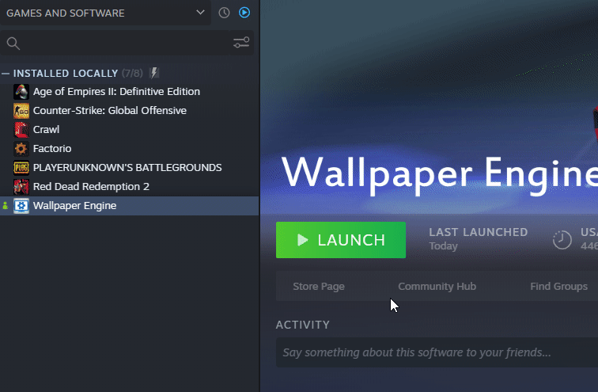

# Hata ayıklama günlüğü oluşturmak için Wallpaper Engine tarama aracını kullanın

Wallpaper Engine'de teknik sorunlar yaşıyor ve sorununuzun çözümünü SSS'de bulamıyorsanız bir sistem günlüğü dosyası oluşturabilir ve bizimle paylaşabilirsiniz:

1. Wallpaper Engine'in çalıştığından emin olun (mümkünse).
2. Steam'deki 4. başlatma seçeneğini tıklayın (*"Çakışan uygulamalar için tarama yapın"*, aşağıda bunun için kısa bir video bulunmaktadır):
3. **Tam Günlüğü Kaydet** seçeneğini tıklayıp masaüstünüze kaydedin (aşağıda kısa bir video bulunmaktadır).
4. Bu yöntemlerden herhangi birini kullanarak günlük dosyasını geliştiricilerle paylaşın:
    * [pastebin.com](https://pastebin.com/) adresine giderek günlük dosyanızın içeriğini yapıştırın ve yapıştırdığınız içeriğin bağlantısını paylaşın.
    * Alternatif olarak, günlük dosyasını bir e-postaya ekleyip bize gönderebilirsiniz. E-posta üzerinden halihazırda bir tartışma yürüttüyseniz lütfen günlük dosyasını ekleyerek son gönderilen e-postayı yanıtlayın. İlk e-postanızı atıyorsanız karşılaştığınız sorunla ilgili bilgi verin ya da mevcut tartışmanın bağlantısını gönderin.
5. *İsteğe Bağlı:* Çökme sorunu yaşıyorsanız herhangi bir **.mdmp** dosyası var mı diye lütfen *wallpaper_engine* dizininizi kontrol edin ve bize e-posta yoluyla ya da bir yerlere yükleyerek gönderin. Çok fazla .mdmp dosyası bulamazsanız lütfen en yenilerini gönderin. ::: tip Tarama aracı ilk bakışta herhangi bir sorun bildirmese bile, günlük dosyasının daha ayrıntılı bir incelemesiyle yaygın bilgisayar sorunları ortaya çıkar. Bu şekilde teknik sorunlarınızın çözümünde size daha hızlı yardımcı olabiliriz. :::

#### Ek video yardımı

**2. Adım**

**3. Adım**

