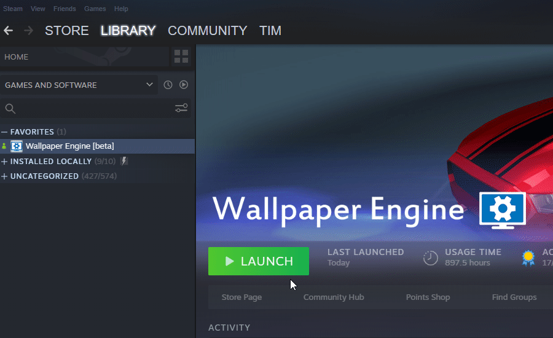

# 使用 Wallpaper Engine 掃描工具建立偵錯記錄

如果您使用 Wallpaper Engine 遇到技術問題，但常見問題集的說明無法解決，您可建立系統記錄檔後提供給我們：

1. 確保 Wallpaper Engine 正在運作 (若可行)。
2. 在 Steam 中選擇第 4 個啟動選項 (*「搜尋衝突的應用程式」*，請參見下方簡短視訊)：
3. 點選**保存完整記錄**，並儲存至桌面 (請參見下方簡短視訊)。
4. 使用下列其中一項方式將記錄檔提供給開發人員：
    * 前往 [pastebin.com](https://pastebin.com/) 並將記錄檔內容複製貼上，接著分享連結。
    * 或者，您可將記錄檔附加至電子郵件，一起傳送給我們。 如果您之前已經傳送電子郵件和我們討論，請回覆上一封電子郵件，並附加記錄檔。 如果是您第一封電子郵件，請詳述問題的內容，或新增包含現有討論的連結。
5. *選用：*如果遇到當機，請檢查 *wallpaper_engine* 目錄中是否存在任何 **.mdmp** 檔案，並利用電子郵件傳送或上傳至某處以提供給我們。 如果您找到許多 .mdmp 檔案，請傳送最新的即可。 ::: 提示 即使掃描工具起初並未回報任何問題，若更深入研究記錄檔，也通常能發現常見的電腦問題，有助我們快速為您提供解決方式。 :::

#### 其他視訊說明

**步驟 2**

**步驟 3**

