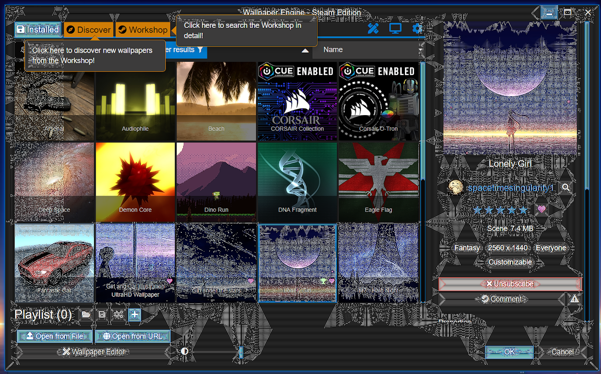

---
tags:
  - 用户界面
  - 绿色
  - 白色
  - 像素化
  - 不可读取
---

# Wallpaper Engine 窗口显示不正确

如果 Wallpaper Engine 浏览窗口无法正常工作，通常的原因是显卡驱动程序或防病毒应用程序故障。 请阅读下文，了解更多信息。

::: warning
请注意 这一部分的内容涉及到 Wallpaper Engine **界面**为黑色或已损坏的问题。 如果您的**壁纸为黑色**，您需要访问：[黑屏/视频不播放](/noshow/notplaying.html)。
:::

## Wallpaper Engine 浏览器为黑色或白色

对大多数人来说，这意味着 Wallpaper Engine 用户界面被防病毒应用程序错误地阻止了。 请务必在防病毒应用程序中设置例外，使其忽略 Wallpaper Engine，具体来说就是 wallpaper_engine 安装目录中的所有可执行文件，尤其是 **wallpaper_engine/bin/ui32.exe**。

在某些情况下，如果防病毒应用程序对某些重要的 Wallpaper Engine 文件设置了永久锁定，则有必要事后验证 Wallpaper Engine 文件，或甚至重新安装 Wallpaper Engine。

* [Steam 支持：验证应用程序文件的完整性](https://support.steampowered.com/kb_article.php?ref=2037-QEUH-3335)

在配置了防病毒应用程序以后，如果通过 Steam 进行的验证仍无法解决此问题，请尝试通过 Steam 重新安装 Wallpaper Engine。 如果防病毒软件失控，它甚至可能永久阻止 Wallpaper Engine 使用的文件路径。 在这种情况下，请务必先卸载防病毒软件，然后再将 Wallpaper Engine 安装到其他目​​录中，您可以为此选择在 Steam 中创建新的 Steam 游戏库。

If the problem persists, turn off Wallpaper Engine. Then re-launch Wallpaper Engine using the third launch option in Steam labeled "disable UI hardware acceleration".

## 带绿色项目或白色线条的 Wallpaper Engine 界面

Your graphics card drivers are broken or misconfigured. Download the latest drivers for your graphics cards (even if you already have the latest drivers) and perform a clean re-installation of the drivers. Is is important that you first uninstall your current drivers and then install the latest drivers to ensure any broken files or settings are removed.

If the problem persists, turn off Wallpaper Engine. Then re-launch Wallpaper Engine using the third launch option in Steam labeled "disable UI hardware acceleration".

**If the Wallpaper Engine user interface has white lines**: You have **Nvidia Image Sharpening** turned on for all applications. Turn it off in your Nvidia drivers or do a clean reinstallation of your Nvidia drivers by uninstalling your current ones first.

 *White lines will be visible all over the application window if Nvidia image sharpening is turned on for Wallpaper Engine by mistake.*

### 罕见的 Steam overlay 错误导致 Wallpaper Engine 用户界面损坏

The other possible reason for a black application window is a rare Steam bug with the Steam overlay. You can try the following:

Turn off Wallpaper Engine completely (right-click on the tray icon and then select "Quit"). Afterwards, open up Steam, right-click on Wallpaper Engine, select "Properties" and then disable the "Enable Steam Overlay while in-game" option. After disabling the option, try to restart Wallpaper Engine via Steam. 